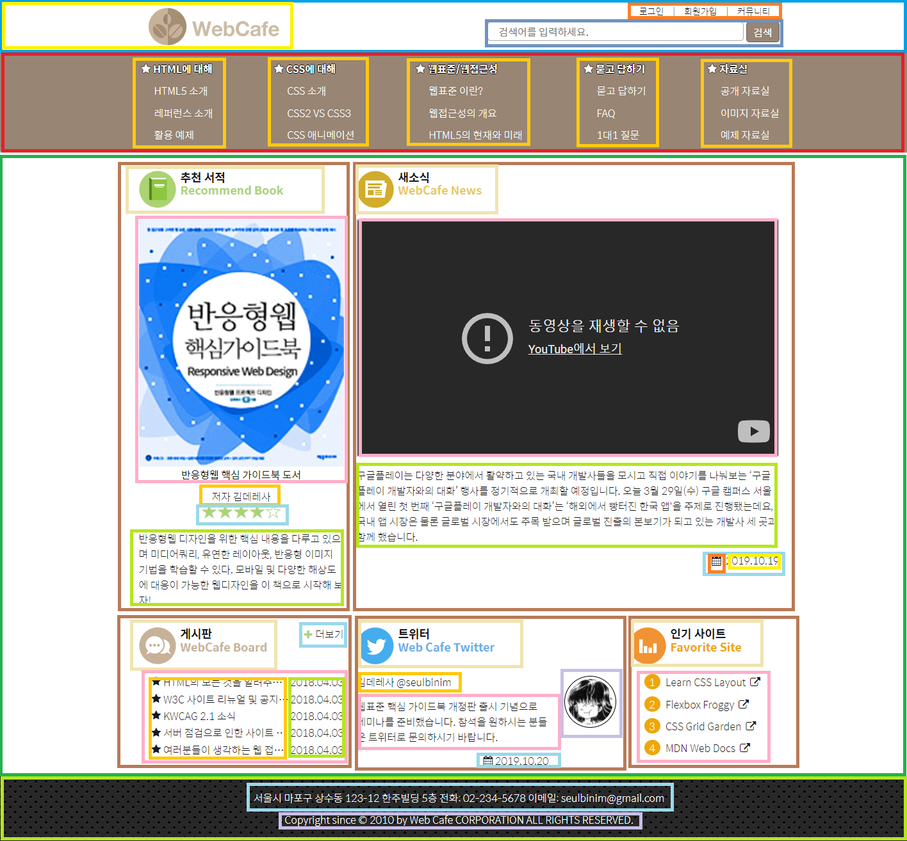

# WebCafe_Bookshelf

## 1. 기획

## 1.1. 참조할 사이트

- [WebCafe github](https://github.com/seulbinim/webcafeRWD)

## 1.2. 핵심 기능

- WebCafe를 참조하여 HTML 문서 작성
- WebCafe와 같은 구조로 디자인 적용

## 1.3. 사용 기술

- HTML
- CSS

# 2. ToDo

- [ ]  html문서 작성
- [ ]  header에 디자인 적용
- [ ]  nav에 디자인 적용
- [ ]  main content 추가
- [ ]  main 디자인 적용
- [ ]  footer 디자인 적용

## 2.1. WebCafe 구조 분석
